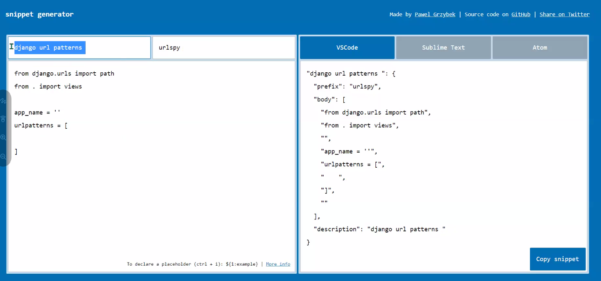
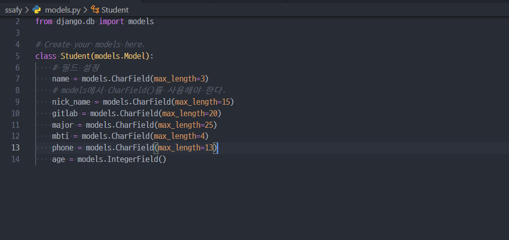
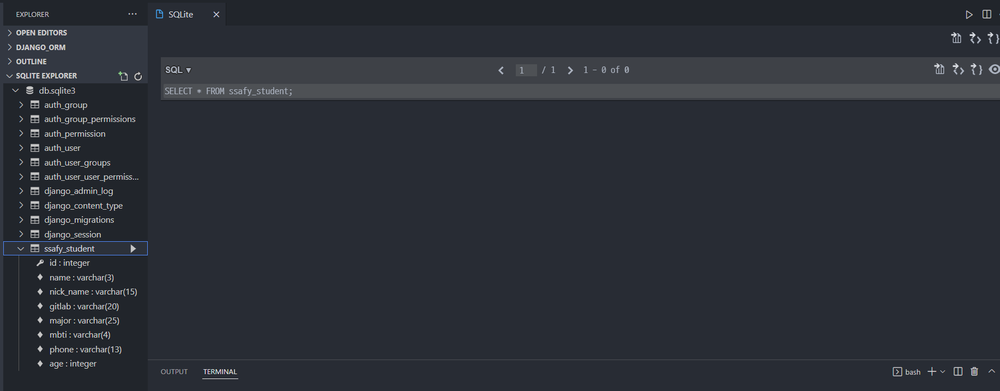
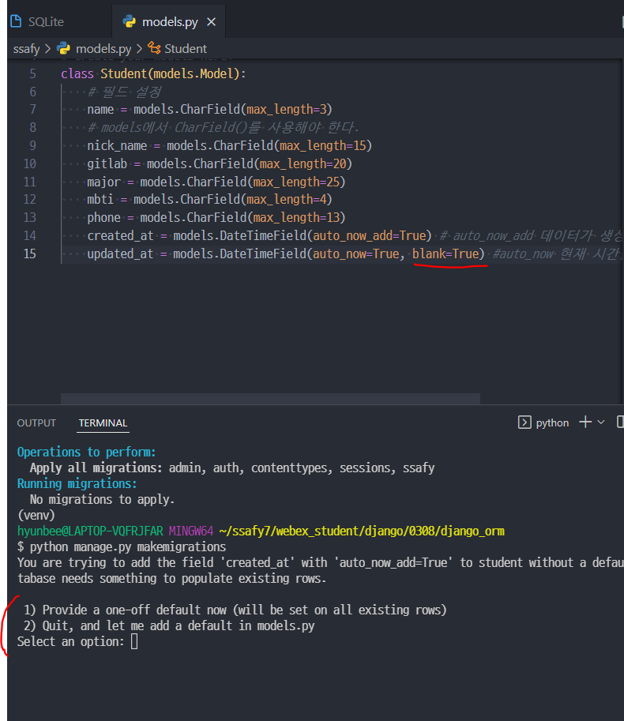
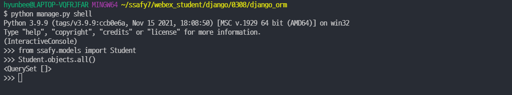
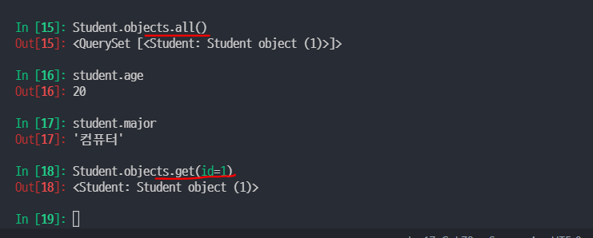
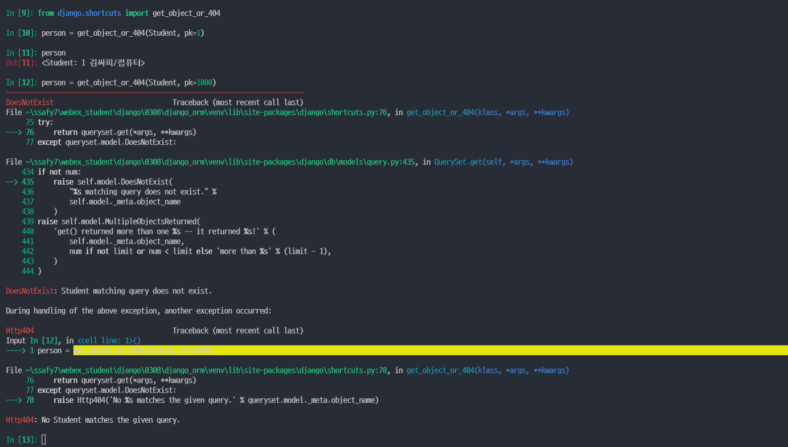

Model

### Model

- 단일한 데이터에 대한 **정보**를 가짐
  - 사용자가 저장하는 **데이터들의 필수적인 필드들과 동작들을 포함**한다.

- 저장된 데이터베이스의 구조(layout)

- django는 model을 통해 데이터에 접속하고 관리
- 일반적으로 각각의 model은 하나의 데이터베이스 테이블에 매핑된다.
- 장고는 **OOP로 데이터베이스를 정의**한다. (DB를 **조작**한다.)


### Database

- 데이터베이스(DB)
  - **체계화된 데이터**의 모임
- 쿼리(Query)
  - 데이터를 조회하기 위한 명령어
  - 조건에 맞는 데이터를 추출하거나 조작하는 명령어
  - "Query를 날린다." => DB를 조작한다.


### Database의 기본구조

- 스키마(Schema)

  - DB의 구조와 제약조건(자료의 구조, 표현방법, 관계)에 관련한 전반적인 명세를 기술한 것
    - 특정 열에는 3글자 이상, 정수여야만 한다던지 제한하는 것이다.

  - 데이터베이스에서 자료의 구조, 표현방법, 관계등을 정의한 구조(structure)

- 테이블(Table)
  - 열(column) : 필드(field) or 속성
    - 각 열에는 고유한 데이터 형식(daua type)이 지정된다.
  - 행(row) : 레코드(record) or 튜플
    - 테이블의 데이터는 행에 저장된다. 즉, user 테이블에 4명의 고객정보가 저장되어 있으며, 행은 4개가 존재한다.

- PK(기본키)
  - 각 행(레코드)의 **고유값**으로 Primary Key로 불린다.
  - **반드시 설정**하여야 하며, 데이터베이스 관리 및 관계 설정시 중요하게 활용된다.


### Model 정리

- "웹 애플리케이션의 데이터를 **구조화** 하고 **조작**하기 위한 도구"


---


## ORM

### ORM

- Object-Relational-Mapping
- 객체 지향 프로그래밍 언어를 사용하여 호환되지 않는 유형의 시스템간에(Django - SQL)데이터를 변환하는 프로그래밍 기술
- OOP 프로그래밍에서 RDBMS을 연동할 때, 데이터베이스와 객체지향 프로그래밍
- 언어간의 호환되지 않는 데이터를 변환하는 프로그래밍 기법
- Django는 내장 Django ORM을 사용한다.
  - 따로 쿼리를 몰라도 데이터베이스에 접근하여 조작하여 데이터를 다룰 수 있다.

- 파이썬 형태로 요청하면 ORM을 통해 SQL로 변환되어 DB에 접근하고 DB에서 통신하면 ORM이 파이썬 형태로 변환하여 전달해준다.


### ORM의 장점과 단점

- 장점
  - SQL을 잘 알지 못해도 DB조작이 가능
  - SQL의 절차적 접근이 아닌 객체 지향적 접근으로 인한 높은 생산성
- 단점
  - ORM만으로 완전한 서비스를 구현하기 어려운 경우가 있음
- 현대 웹 프레임워크의 요점은 웹 개발의 속도를 높이는 것이다.  **(생산성)**


### ORM을 왜 사용할까?

"우리는 DB를 객체(object)로 조작하기 위해 ORM을 사용한다."


### models.py 작성

```python
class Article(models.Model): # 상속받고 있다.
    title = models.CharField(max_length = 10)
    constend = models.TextField()
```


- DB컬럼과 어떠한 타입으로 정의할 것인지에 대해 django.db라는 모듈의 models를 상속
  - 각 모델은 django.db.models.Model 클래스의 서브 클래스로 표현
- title과 content은 모델의 필드를 나타낸다.
  - 각 필드는 클래스 속성으로 정의되어 있으며, 각 속성은 각 데이터베이스의 열에 매핑된다.


### 사용 모델 필드

- CharField(max_length=None, **options)
  - 길이의 제한이 있는 문자열을 넣을 때 사용
  - CharField의 max_length는 필수 인자
  - **필드의 최대 길이(문자)**, 데이터베이스 레벨과 Django의 유효성 검사(값을 검증하는 것)에서 활용

- TextField(**options)
  - 글자의 수가 많을 때 사용
  - max_length옵션 작성시 자동 양식 필드인 textarea 위젯에 반영은 되지만 모델과 데이터베이스 수준에는 적용되지 않는다.
  - max_length는 CharField에서 사용해야 한다. TextField에서는 사용되지 않는다.


---

## Snippet 생성하기

- https://snippet-generator.app/



- VSCode > File Preferences > user snippet > my_snippet.json.code-snippets


---


### 필드설정하기



- https://docs.djangoproject.com/en/4.0/ref/models/fields/
  - 참고하여 공부하기


---


## Migrations

### Migrations

- "django가 model에 생긴 변화를 반영하는 방법"
- Migration(이하 마이그레이션) 실행 및 DB 스키마를 다루기 위한 몇 가지 명령어
  - **makemigrations**
  - **migrate**
  - sqlmigrate
  - showmigrations


### Migrations Commands (중요)

주관식으로 자주 출제되는 명령어 


- **makemigrations**

  - model을 변경한 것에 기반한 새로운 마이그레이션(like 설계도)을 만들 때 사용
  - 필드 정보가 수정되었을 때는 makemigrations을 해야 한다. (새롭게 설계도를 만드는 개념)

- **migrate**

  ``` bash
  python manage.py migrate
  ```

  - dq.sqlite3 에서 Opendatabase 클릭 (오른쪽 마우스 우 클릭)
  - 마이그레이션을 DB에 반영하기 위해 사용한다.
  - 설계도를 실제 DB에 반영하는 과정이다
  - 모델에서의 변경 사항들과 DB의 스키마가 동기화를 이룬다.
  - **테이블 명 시험**에 자주 출제
    - **테이블 이름 규칙**(중요)
      - **''앱이름_클래스명''**
      - 스네이크규칙
      - 클래스명을 테이블명과 동일하게 짓지 말아야 한다.
      - 문제 ) 앱이름과 클래스명이 주어졌을 때 테이블 명 적어보기




- sqlmigrate

  - 마이그레이션에 대한 SQL 구문을 보기 위해 사용
  - 마이그레이션이 SQL문으로 어떻게 해석되어서 동작할 지 미리 확인할 수 있음.

  ``` bash
  $ python manage.py sqlmigrate ssafy 0001
  ```

- showmigrations

  - 프로젝트 전체의 마이그레이션 상태를 확인하기 위해사용한다.

  - 내가 만든 설계도가 DB에 적용이 되었는지 확인할 수 있는 명령어

    ``` bash
    $ python manage.py showmigrations
    ```

  - X 이면 적용이 되었다는 의미다.

---

### 실습model수정(1/3)

- models.DateTimeField(auto_now_add=True)
  - **auto_now_add** : 데이터가 생성될 때 시간을 자동으로 저장하는 옵션 (중요)
  - **auto_now**=True : auto_now 현재 시간을 자동으로 저장



- 장고가 default 값을 만들어주는 것 > 1
- 직접 models.py에서 디폴트 값을 추가한다 > 2

- blank=True 속성 혹은 null=True로 하면 아래 선택메세지가 뜨지 않는다.


#### null과 blank의 차이점

- 휴지가 존재조차 하지 않으면 null
- 휴지를 다써서 곽만 남은 상태면 blank
- 문자열로 저장되는 것 같다면 blank를 True로 주자 (암기)
- 숫자로 저장되는 것 같다면 null을 True로 주자(암기)


- models.py 수정 후 makemigrations > migrate > DB 확인(새로고침 필요)


---


## DataBase API


### DB API

- DP를 조작하기 위한 도구
- Django가 기본적으로 ORM을 제공함에 따른 것으로 DB를 편하게 조작할 수 있도록 도움.

https://docs.djangoproject.com/en/4.0/ref/models/querysets/

- 버전을 3.2로 맞춰준다

- Model을 만들면 Django는 객체들을 만들고 읽고 수정하고 지울 수 있는 database-abstract API를 자동으로 만든다.
- database-abstract API 혹은 database-access API라고도 한다.


### DB API구문 - Making Queries

- 클래스명.매니저.쿼리셋API(메서드)
- Article.objects.all()


### DB API

- Manager
  - Django 모델에 데이터베이스 query 작업이 제공되는 인터페이스
  - 기본적으로 모든 Django 모델 클래스에 objects라는 Manager를 추가한다.
- QuerySet
  - 데이터베이스로부터 잔달받은 객체 목록
  - queryset 안의 객체는 0개 , 1개 혹은 여러 개 일 수 있음
  - 데이터베이스로부터 조회, 필터, 정렬 등을 수행할 수 있음


### Django Shell

- 일반 Python shell을 통해서는 장고 프로젝트 환경에 접근할 수 없음
- 그래서 장고 프로젝트 설정이 load된 Python shell을 활용해 DB API구문 테스트 진행
- 기본 Django shell보다 더 많은 기능을 제공하는 shell_plus를 사용해서 진행



- QuerySet은 데이터가 0개 이상인 경우 <QuerySet []>로 나온다.
- QuerySet도 유사 리스트로 인덱싱 슬라싱이 가능하다.

https://django-extensions.readthedocs.io/en/latest/

- Getting Started 에 적힌 방법을 참고하여 
- ipython을 설치하여 조금 더 직관적으로 출력할 수 있다.


---


## CRUD

### CRUD

- 대부분의 컴퓨터 소프트웨어가 가지는 기본적인 데이터 처리 기능인 Create(생성), Read(읽기), Update(갱신), Delete(삭제)를 묶어서 일컫는 말 




- get메서드는 원하는 데이터가 한 개일 때 사용하는 메서드이다.

  


---

### get() 

- get() 객체를 찾을 수 없으면 예외를 발생시킨다. (아래참고)




### filter

- 주어진 lookup 매개변수와 일치하는 객체를 포함하는 새 QuerySet을 반환
- filter는 조건을 만족하는 모든 데이터를 반환한다.
- 데이터가 여러개가 반환될 수 있으므로 리턴되는 값이 QuerySet이다. 
- 반면, get은 한 개만 리턴해주므로 해당 instance로 반환된다.
- 조건을 만족하지 못하면 비어있는 쿼리셋을 반환한다. 


### Update

1. DB에서 수정할 data를 가져온다.
   - 클래스명.objects.get(pk=1)
     - 한 개만 수정하기 위해서 get을 이용한다.
     - 인스턴스가 return된다.
2. 가져온 데이터의 값을 변경한다.
3. 변경한 값을 save한다.
   - 클래스명.save()


---


## Admin Site

### Automatic admin interface

- 사용자가 아닌 서버의 관리자가 활용하기 위한 페이지
- Model class를 admin.py에 등록하고 관리
- django.contrib.auth 모듈에서 제공됨
- record 생성 여부 확인에 매우 유용하며, 직접 record를 삽입할 수도 있음

