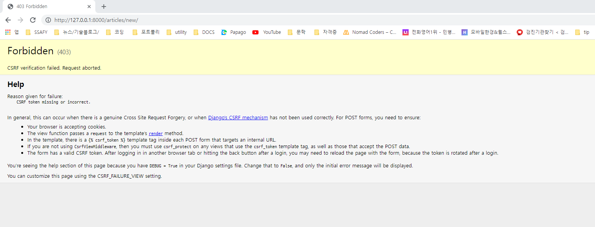

### Intro

- 우리는 지금까지 HTML form, input을 통해서 사용자로부터 데이터를 받음
- 이렇게 직접 사용자의 데이터를 받으면 입력된 데이터의 유효성을 검증하고, 필요시에 입력된 데이터를 검증 결과와 함께 다시 표시해야 한다.
  - 사용자가 입력한 데이터는 개발자가 요구한 형식이 아닐 수 있음을 항상 생각해야 한다.
- 이렇게 사용자가 입력한 데이터를 검증하는 것을 유효성 검증이라고 하는데, 이 과정을 코드로 모두 구현하는 것은 많은 노력이 필요하다.
- Django는 이러한 과중한 작업(**유효성 검증)과 반복 코드를 줄여줌**으로써 이 작업을 훨씬 쉽게 만들어준다. -> **Django Form**


### Django's form

- Form은 Django의 **유효성 검사 도구** 중 하나로 외부의 악의적인 공격 및 데이터 손상에 대한 중요한 방어 수단
- Django는 Form과 관련한 유효성 검사를 단순화하고 자동화 할 수 있는 기능을 제공하여 개발자로 하여금 직접 작성하는 코드보다 더 안전하고 빠르게 수행하는 코드를 작성할 수 있게 한다.
- Django는 **form**에 관련된 작업의 아래 세 부분을 처리해준다.
  1. 렌더링을 위한 **데이터 준비 및 재구성**
  2. 데이터에 대한 **HTML forms 생성**
  3. 클라이언트로부터 받은 **데이터 수신 및 처리**


### The Django 'Form Class'

- Django Form 관리 시스템의 핵심
- Form 내 field, field 배치, 디스플레이 widget, label, 초기값, 유효하지 않는 field에 관련된 에러 메시지를 결정
- Django는 사용자의 데이터를 받을 때 해야할 과중한 작업(데이터 유효성 검증, 필요시 입력된 데이터 검증 결과 재출력, 유효한 데이터에 대해 요구되는 동작 수행 등)과 반복 코드를 줄여준다.
- Django의 Form을 사용하기 위해 Form class를 작성해야 한다. 해당 Form class를 상속받아 서브클래스로 사용할 것이다.


### Form 선언하기

```python
# articles/ forms.py
from django import forms

class ArticleForm(forms.Form):
    title = forms.CharField(max_length=10)
    content = forms.CharField()
```

- 직접 파일을 생성하여 작성한다. forms 모듈을 불러온다.
- Model을 선언하는 것과 유사하며 같은 필드타입을 사용(또한, 일부 매개변수도 유사함)
- forms 라이브러리에서 파생된 Form 클래스를 상속받는다.

### Form 사용하기

```python
# articles/ views.py
from . forms import ArticleForm

def new(request):
    form = ArticleForm()
    context ={
        'form' : form
    }
    return render(request, 'articles/new.html', context)
```

- form 인스턴스를 생성한다.
- form은 사용자의 input을 받는 부분을 관여한다.

``` django
<form action="" method="POST">
    
    {{ form }}
</form>
```

- form을 변수로 출력한다.
- label과 input이 자동으로 만들어진다. 
-  form클래스에 작성한 매개변수,(ex. max_length=10)이 유효하게 동작한다.

- form에 textField를 제공하지 않지만 위젯을 이용해 해결할 수 있다.


### Form rendering options

- 렌더링에 관련된 세가지 옵션을 제공해준다.

1. as_p()
   - 각 필드가 p태그로 감싸져서 렌더링 된다.
2. as_ul()
   - 각 필드가 목록 항목으로 감싸져서 렌더링 된다
   - ul 태그는 직접 작성해야 한다.
3. as_table()
   - 각 필드가 테이블 행으로 감싸져서 렌더링 된다.
   - table 태그는 직접 작성해야 한다.

```django
{{ form.as_p }}
```


### Django의 HTML input 요소 표현 방법 2 가지

1. Form Fields
   - input에 대한 유효성 검사 로직을 처리하며 템플릿에서 직접 사용된다.
   - ex) CharField, input의 텍스트 속성
2. Widgets
   - 웹 페이지의 HTML input 요소 렌더링
   - GET/POST 딕셔너리에서 데이터 추출
   - widgets은 반드시 Form fields에 할당된다.
   - 체크박스, 라디오 박스 등으로 input을 받아야 할 때가 있지만 Field가 모두 제공되지 않는다. ex) TextField
   - 위젯은 단독으로 사용할 수 없다. 필드에서 먼저 지정후, 필드에서 사용할 수 없는 것들을 위젯으로 설정한다.

```python
# articles/forms.py
from django import forms

class ArticleForm(forms.Form):
    title = forms.CharField(max_length=10)
    content = forms.CharField(widget=forms.Textarea)
```


### Widgets

- Django의 HTML input element의 **표현**
- HTML 렌더링 처리

- 주의사항
  - Form Fields와 혼동되어서는 안된다.
  - Form Fields는 Input 유효성 검사를 처리한다.
  - Widgets은 웹 페이지에서 input elemetns의 단순 raw한 렌더링을 처리


### GET과 POSET

- Data를 조회할 때는 GET

- DB에 변경이 있을 때 POST

  - CREATE 시 > POST
  - READ > GET
  - UPDATE > POST
  - DELETE > POST

  - **주소줄을 이용한 요청은 GET**
  - **redirect**는 **GET**요청

- method를 POST로만 변경하고 난 후,

  

  - 403 Forbidden 에러가 발생한다. 
    - 서버에 요청이 전달되었지만 권한 때문에 거절되었다는 것을 의미한다.
    - CSRF verification failed.
    - CSRF란 사이트 간 요청 위조이다. 웹 사이트 취약점 공격의 하나로, 사용자가 자신의 의지와는 무관하게 공격자가 의도한 행위를 특정 웹사이트에 요청하게 하는 공격을 말한다.

---

### ETC

- a 태그와 같이 단순 링크이동도 GET요청과 같다.

### POST

-  필수로 기재한다.

- views.py에 

  ``` python
  article = Article()
  article.title = request.POST.get('title')
  article.content = request.POST.get('content')
  article.save()
  ```

  - request를 POST로 받는 것 기억하기

  