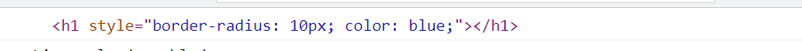

# 🌱 ES6

- ES6는 자바스크립트에 많은 변화를 가져온 큰 업데이트. 


### Let and Const

- let과 const 전에 우리가 사용했던 것은 var.
  - 큰 애플리케이션 제작에서 var는 큰 문제를 야기할 수 있다.
  - var로 같은 이름을 사용하게 될 시 해당 변수가 다른 개발자에 의해 의도치않게 변할 수 있다.
  - variable이 변하는 걸 막기 위한 어떤 메커니즘이 필요하다. const가 나온 바탕이다.
- const
  - 사용을 권장한다.
- let
  - 값을 바꿀 수 있다.
  - 값을 변경해야 한다면 let을 사용한다.


### Temporal dead zone

- Temporal dead zone은 let이랑 같이 소개되는 개념이다.

- 자바스크립트는 위에서부터 아래로 코드를 실행하는데 var 하단에 정의된 걸 위에서 console.log를 통해 띄우려 할 수 있다.(undefined 출력)
- 이는 'hoisting'의 개념과 관련이 있다.

#### hoisting

- 자바스크립트가 프로그램을 실행하기 전에 변수 등을 상단으로 끌어올려 준다. 실제로 정의되기 전에 호출해도 에러를 띄우지 않고 undefined를 출력한다. 
- 에러를 내야 하는 상황에서 에러를 내지 못한다. 
- let은 var와 다르게 정의되어 있지 않다고하며 에러를 발생시킨다. (안전하다.)


### Block scope

#### scope

- 기본적으로 버블이며,

- 이 버블이 variabl들이 접근 가능한지 아닌지를 감지해준다. 

  ```javascript
  if (true) {
      const hello = 'hi';
  }
  console.log(hello); // 출력되지 않는다. 에러 발생
  ```

- const와 let 모두 block scope로 되어있다. 해당 블록내에서만 존재한다는 의미다. 

- var는 block scope를 가지지 않고 function scope를 가진다. 

  - function scope 의 뜻은 var가 function 안에서 접근할 수 있다는 의미다

  ```javascript
  function a () {
      const hello = ' hi';
  }
  console.log(hello); // error 발생

---


## 🌱 FUNCTIONS

### arrow function

- arrow function은 자바스크립트에서 함수의 모습을 개선한 것으로 코드를 더 쉽게 볼 수 있도록 하는 방법이다.

- 기존에 function을 만들려면 function을 적고 함수의 이름을 적은 후 arguments들이 오고 block을 생성한다.

  ```javascript
  function 함수이름 (인자들) {
      //블록
  }
  ```

​	혹은 익명함수로 아래와 같이 작성할 수 도 있다.

```javascript
function(인자들) {
    //블록
}
```


- ' => ' 을 arrow라고 한다.

```javascript
const names = ['사과'. '포도', '바나나']

const hearts = names.map(functions(item) {
          return '내가 좋아하는 것 :' + item;
          })
// map은 각각의 아이템마다 함수를 호출한다.
// 이 때 map은 무언갈 return 해줘야 한다. 무엇을 return 하던지 간에 새로운 array로 추가될 것이다.

// 위의 코드를 더 보기좋게 만들면 아래와 같다. arrow function을 사용해보자.

const hearrs = names.map(item =>  '내가 좋아하는 것 :' + item;)
```

- arguments가 하나만 있는 경우 괄호가 필요없고, 두 개 이상의 인자가 있을 경우 괄호가 필요하다.


### 'this' in Arrow Functions

- arrow function을 사용하지 않아야 할 때 - this 키워드를 사용해야 하는 경우

- 이벤트 리스너를 하위에 function이 있을 때 자바스크립트는 우리가 클릭한 버튼을 this 키워드에 넣는다.

  ```javascript
  const button = document.querySelector("button");
  
  vutton addEventListener("click", function() {
     console.log(this) // 버튼 태그가 출력된다.
     console.log("clicked"); 
  });
  
  vutton addEventListener("click", () =>) {
     console.log(this) // 버튼태그 대신 window가 출력된다. this 가 더이상 button을 가리키지 않는다.
     console.log("clicked"); 
  });
  ```

  - arrow function 안에 있는 this는 window를 참조한다.
  - arrow function은 this를 이벤트로부터 가지고 있지 않는다. arrow function은 this를 window object로 가지고 있다.


### Arrow Functions in the Real World!

#### find

- Array.prototype.find는 제공되는 테스트 조건을 만족하는 첫번째 엘리먼트 값을 리턴하는 함수.

```javascript
email = ["su@eun.com", "naver@google.com", "lynn@gmail.com", "nico@nomad.com"]
// gmail.com을 찾아보자

const foundMail = email.find(item => item.includes("@gmail.com"));
console.log(foundMail)
```


#### filter

- filter 메소드는 제공된 함수의 조건을 만족한 모든 엘리먼트를 새로운 array로 만들어 반환한다.

```javascript
emails = ["su@eun.com", "naver@google.com", "lynn@gmail.com", "nico@nomad.com"]
// gmail.com을 찾아보자

const noGmail = emails.filter(email => !email.includes("@gamil"))
console.log(noGmail)
```


#### forEach

- forEach 메소드는 각 array의 엘리먼트마다 제공된 함수를 실행한다.

  ```javascript
  emails = ["su@eun.com", "naver@google.com", "lynn@gmail.com", "nico@nomad.com"]
  // gmail.com을 찾아보자
  
   emails.forEach(email => {
    console.log(email.split("@")[0])
   })
  ```

  

#### map

- map은 forEach지만 반환된 element들로 새로운 array를 만들어준다.

  ```javascript
  emails = ["su@eun.com", "naver@google.com", "lynn@gmail.com", "nico@nomad.com"];
  // gmail.com을 찾아보자
  
   const cleaned = emails.map(email => email.split("@")[0]);
   console.log(cleaned);
  ```


#### object를 반환하는 방법

```javascript
emails = ["su@eun.com", "naver@google.com", "lynn@gmail.com", "nico@nomad.com"];
// gmail.com을 찾아보자

 const cleaned = emails.map((email, index) => ({
   username:email.split("@")[0], index:index
  }));
 console.log(cleaned);
```


### Default Values

ES6에서 function에 한 가지 더 추가된 점은 default value 기본 값이다. 

기본값은 arrow function 뿐만 아니라 일반 함수에도 적용할 수 있다.

```javascript
function sayHi(aName) {
  return "Hello " + aName;
}

console.log(sayHi("sueun"))
// 만약 사용자가 이름을 입력안하면 어떻게 출력될까 ? undefined로 출력된다. 
// 보기 영 좋지 않다. 기본값을 이용하여 이런 부분들을 보완할 수 있다.
```

```javascript
function sayHi(aName = "anonymous") {
  return "Hello " + aName;
}

console.log(sayHi()) // "Hello anonymous" 로 출력된다.
```

- 아래처럼 쓰일 수도 있다.

```javascript
const sayHi = (aName = 'anonymous') => "hello " + aName;

console.log(sayHi())
```


---

## 🌱 STRINGS

### Strings

- 자바스크립트에서 variable을 가진 문자열을 쓰는 방법에 대해 알아보자.

```javascript
const sayHi = (aName = 'anonymous') => "hello " + aName;

console.log(sayHi())
```

를 아래와 같이 바꿀 수 있다.

```javascript
const sayHi = (aName = 'anonymous') => `hello ${aName} lovely to have you`;

console.log(sayHi())
```

- 표현식도 넣을 수 있다.


### HTML Fragments

- string 안에 표현식을 넣을 수 있다는 점 말고도 template literal을 멋지게 사용할 수 있는 경우는 **javascript 안에서 html을 쓸 수 있을 때**이다.

- HTML Fragments 생성 

  ```javascript
  const wrapper = document.querySelector(".wrapper");
  
  const addWelcome = () => {
    const div = `
    	<div class="hello">
    		<h1 class="title">Hello</h1>
    	</div>
    `;  
      wrapper.innerHtml = div;
  };
  
  setTimeout(addWelcome, 2000);
  ```

  - template literal이 내가 만드는 space, enter도 고려해준다.
    - single quotes와 double quotes는 줄 바꿈을 지원하지 않는다

  ```javascript
  // template literal의 또다른 예제
  const wrapper = document.createElement(".wrapper");
  const friends = ["me", "lynn", "dal", "mark"];
  
  const list = `
  	<h1>
  		<ul>
  			${friends.map(friend => `<li>${friend}</li>`).join("")}
  		</ul>
  	</h1>
  `;
  
  wrapper.innerHtml = list;
  ```

  

### Cloning Styled Components

- styled components는 리액트를 위한 라이브러리, 패킷 같은 개념
  - JS에서 css를 쓸 수 있게 해주며 html을 얻을 수 있게 해준다.

- 아래 예제는 template literal을 이용하여 styled components를 클론한 것


1. function
   - function은 우리가 만들고 싶은 element를 받고 
   - 적용하고 싶은 CSS도 받은 다음에 
   - CSS를 적용한 element를 리턴한다. 

```javascript
const styled = (css) => {console.log(css)}

styled`background-color:#fff;
border-radius:10px`;


```

아래와 같이 출력된다.

[ 'background-color:#fff;\nborder-radius:10px' ]

- 이렇게 함수를 호출하면 string들은 styled의 arguments로 들어가게 된다.

```javascript
const styled = aElement => {
  const el = document.createElement(aElement);
  return args => {
    const styles = args[0];
    el.style = styles;
    return el
  };
};

const title = styled("h1")`
  border-radius:10px;
  color:blue;
`;

console.log(title);
```




### More String Improvements!

1. string.includes()

   - email과 관련하여 유용하게 사용할 수 있다.

2. string.repeat()

   - 원하는 어떤 글자든 반복할 수 있다.

     ```javascript
     const CC_NUMBER = "6060";
     
     const displayName = `${"*".repeat(10)}${CC_NUMBER}`;
     
     console.log(displayName)
     ```

3. string.startsWith()

   ```javascript
   const name = "Ms. Sueun";
   console.log(name.startsWith("Ms"));
   ```

   - 참이 반환된다

4. string.endsWith()

   ```javascript
   const name = "Ms. Sueun";
   console.log(name.endsWith("Sueun"));
   
   ```

   - 참이 반환된다.
   - 유효성 검사와 관련하여 유용하게 사용할 수 있다. (이메일에서 .com으로 끝나는 지 확인할 수 있다.)


---


# 🌱 ARRAY

## Array.from() and Array.of()

#### Array.of

- 어떤 걸 array로 만들고 싶을 때 사용한다.

  ```javascript
  const friends = Array.of("nico", "bee","hodoo", "fox")
      console.log(friends)
  ```

  ```html
  <button class="btn">1</button>
    <button class="btn">2</button>
    <button class="btn">3</button>
    <button class="btn">4</button>
    <button class="btn">5</button>
    <script src="https://cdn.jsdelivr.net/npm/bootstrap@5.1.3/dist/js/bootstrap.bundle.min.js" integrity="sha384-ka7Sk0Gln4gmtz2MlQnikT1wXgYsOg+OMhuP+IlRH9sENBO0LRn5q+8nbTov4+1p" crossorigin="anonymous"></script>
    <script>
      const buttons = document.querySelectorAll("button");
      Array.from(buttons).forEach(button => {
        button.addEventListener("click", () => console.log("I ve been clicked"))
      });
    </script>
  ```

  - 어떤 상황에서는 array를 얻지 못한다. 위의 buttons도 array-like object에 해당한다.
  - Array.from()에서 괄호 안에 array-like objects를 받아서 array로 만들어준다.


## Array.find(), Array.findIndex(), Array.fill()

#### array.find()

- find는 조건이 있어야 한다.

- 조건을 만족하는 첫 번째 요소를 리턴해준다.

#### array.findIndex()

- findIndex는 find와 같다.
- element가 어디 있는 지 알고 싶을 때 사용한다.

```javascript

    const emails = [
      "lynn@korea.com",
      "hodo@gmail.com",
      "mom@naver.com",
      "soon@gorea.com"
    ];

    const target = emails.findIndex(email => email.includes("gorea.com"));
    console.log(target)
    console.log(emails[target])
    if (target !== -1) {
      const username = emails[target].split("@")[0];

      const email = "korea.com";

      console.log(`${username}@${email}`);

      emails[target] = `${username}@${email}`;
      console.log(emails);
    }
```


### array.fill()

- fill은 시작지점부터 종료지점까지 static value로 array를 채우는 것이다.

  ```javascript
   const emails = [
        "lynn@korea.com",
        "hodo@gmail.com",
        "mom@naver.com",
        "soon@gorea.com"
      ];
  
      if (target !== -1) {
        emails.fill("*".repeat(5), 1, 3);
      }
        console.log(emails);
  


#### array.includes

- array에서 어떤 걸 갖고 있는지 알고 싶을 때 사용한다.


---

# 🌱DESTRUCTURING

## Object Destructuring

#### destructuring(비구조화)

- destructuring은 object나 array, 그 외 요소들 안의 변수를 바깥으로 끄집어 내서 사용할 수 있도록 하는 것이다.

- 큰 오브젝트에서 특정 변수나 그 안에 속한 작은 오브젝트에 접근할 수 있도록 해준다.

```javascript
  const settings = {
      notifications : {
        follow : true,
        alers : true,
        unfollow : false
      },
      color : {
        theme : "dark"
      }
    };

    const {
        {notifications : {follow = false} = {}},
        // settings안의 notifications 안으로 가서 follow가 있는지 찾아본다.
        // follow가 없다면 follow = false라고 선언해준다.
        // 없을 때 false가 출력된다.
      color
    } = settings

    console.log(follow);
```


## Array Destructuring

- 대괄호를 사용한다.

  ```javascript
  const days = ["MON", "TUE", "WEN", "THU", "FRI", "SAT", "SUN"]
      
  const [mon, tue, wen] = days;
  
  console.log(mon, tue, wen);
  ```

  

  

## Renaming

- API등을 통해 데이터를 받은 경우 원치않는 이름으로 데이터를 받게될 수 있다. 이 때 이름을 바꿔주는 것이 rename이다.

```javascript
const settings = {
      color : {
        chosen_color : "dark"
      }
    };

const {
    color : {chosen_color : chosenColor = "light"}
} = settings

console.log(chosenColor)
```


- chosenColor를 업데이트하는 방식으로 사용하고 싶을 때, 아래와 같이 전체를 소괄호로 감싸준다.
- 새 변수를 생성하는 대신 let변수인 chosenColor를 업데이트 하는 것이다.

```javascript
let chosenColor = "blue";
console.log(chosenColor);

({
    color : {chosen_color : chosenColor = "light"}
} = settings);

console.log(chosenColor);
```


## Function Destructuring

- 유저 세팅을 저장하는 함수 SaveSettings를 만들어보자.

- 함수에 길게 인자를 받는 것보다 settings array에 넣어서 전달하자.

- 변수들의 가독성을 확보하고 각 변수의 기본 값을 설정하려면 어떻게 해야할까?

  - object Destructuring을 사용한다.

  ```javascript
  function saveSettings({follow, alert, color="blue"}) {
        console.log(color);
      };
  
      saveSettings({
        follow : true,
        alert : true,
        mkt : false
      });
  ```


## Value Shorthands

- 변수명과 속성값을 똑같이 사용하고 싶다면 단축속성명을 사용할 수 있다. (shorthand property)
- 단축속성명을 사용하면 변수명만 작성하면 된다.


## Swapping and Skipping

### Variable Swapping

- 일단 let 변수여야 한다.
- 우리는 두 변수의 속성값이 서로 교환되길 원한다면,
  1. 잘못된 변수들을 이용해서 array를 만든다.
  2. 그런 다음 올바른 변수와 함께 array destructuring을 한다.

### omitting

- array에서 특정 값을 생략하는 방법
- days에서 마지막 두 개의 값만 가지고 오고 싶다면?

```javascript
const days = ["mon", "tue", "wed", "thu", "fri", "sat", "sun"]
    const [,,, thu, fri] = days
    console.log(thu, fri)
```


---

# 🌱 REST AND SPREAD

## Introduction to Spread

### ✏ Spread

- 사용방법에 따라 다른 결과를 가져올 수 있다.

- spread는 기본적으로 변수를 가져와서 풀어 해치고 전개하는 것이다.

- spread를 사용하기 위해서는 ... 를 사용해야 한다. ...를 사용하면 array 속에 들어있는 데이터가 보이는 것이아니라 array안에 들어있는 변수들이 바로 보인다.

  ```javascript
  const days = [1, 2, 3, 4];
  
  console.log(...days);
  ```

- 여러개의 array를 합치고 싶을 때 spread를 이용한다.

  ```javascript
  const days = [1, 2, 3, 4];
  const alp = ["a", "b", "c"];
  
  console.log([...days, ...alp]); //(7) [1, 2, 3, 4, 'a', 'b', 'c']
  ```

- 객체끼리 합칠때도 사용할 수 있다.


## Spread Applications

- 어떻게 하면 object에 속성(property)을 조건부로 추가할 수 있는가?

  ```javascript
  const lastName = prompt("Last name : ")
  
  const user = {
      username : "nico",
      age : 24,
      lastName : lastName !== "" ? lastName : undefined
  };
  
  console.log(user)
  ```

  ```javascript
  const lastName = prompt("Last name : ")
  
      const user = {
        username : "nico",
        age : 24,
        ...(lastName !== "" && {lastName})
      };
  
      console.log(user)
  ```


## Intro to Rest Parameters

- Parameter(매개변수)라는건 우리가 함수에게 전달하는 인자들을 이야기 한다.
- 그렇다면 rest parameter는 무엇일까
  - 끝도 없는 parameter를 전달받는 함수를 만들어서 이해해보자.
  - parameter에 들어가면 rest로 사용된다고 봐도 된다.

- spread는 전개였다면 rest는 축소와 같다.

```javascript
const infiniteArgs = (...kimchi) => console.log(kimchi)

infiniteArgs("1",2, true, "lalala", "dkdkdkdkkmd", 4, false)
```

- rest는 모든 값을 하나의 변수로 축소(contract) 시켜주는 것이다.

```javascript
const bestFriendsMaker = (firstOne, ...rest) => {
      console.log(`my best friend is ${firstOne}`);
      console.log(`There are ${rest}`)
};

bestFriendsMaker('nico', 'lynn', 'dall', 'japan guy');
```

- rest는 array를 만든다. 


## Rest + Spread + Destructure Magic 

1. 특정 속성 값 제외시키기 

   ```javascript
   const user = {
         name : "nico",
         age : 25,
         password : 12345
       }
   
       const killPassword = ({password, ...rest}) => rest;
       const cleanuser = killPassword(user)
       console.log(cleanuser)
   ```

    - object를 지우거나 정리할 때 사용한다.

2. 기본값 설정하기

   ```javascript
   const user = {
         name : "nico",
         age : 25,
         password : 12345
       }
   
       const setCountry = ({country = "KR", ...rest}) => ({country, ...rest});
       console.log(setCountry(user))
   ```

   - rest 구문을 이용해서 입력 인자의 나머지 값들을 하나로 축소했고, 
   - 그리고나서 country와 함께 나머지 값을 담고 있는 rest 변수를 전개하여 return해준다.

3. 속성명 바꾸기(rename property)

   ```javascript
   const user = {
         NAME : "nico",
         age : 25,
         password : 12345
       }
   
       const rename = ({NAME:name, ...rest}) => ({name, ...rest})
       console.log(rename(user))
   ```

   - destructuring을 사용하여 변수를 rename해주었다. 
   - rest구문과 spread 구문을 모두 사용했다.


---

# 🌱 FOR OF LOOP

## For .. of

- 루프는 기본적으로 같은 일을 반복적으로 하는 것이다. 

  ```javascript
  const friends = ["nico", "bee", "hodoo", "soon"];
      
      for (const friend of friends) {
        console.log(friend);
      }
  ```

- For ..of 대신 forEach를 사용할 수 있다. forEach는 배열에 있는 각각의 엘리먼트에 대해 특정한 액션을 실행해준다.

  ```javascript
  const friends = ["nico", "bee", "hodoo", "soon"];
  
  friends.forEach((friend,idx, arr) => console.log(friend, idx, arr));
  ```


- for of의 응용

  1. for of는 array에서만 동작하는 것이아니라, iterable한 모든 것에서 동작한다.

     - iterable하다는 것은 루프가 가능하다는 의미다.

       - String에서도 가능하다. NodeLists에서도 가능하다.

         ```javascript
         for (const friend of "longwordsgogogogo") {
               console.log(friend);
             }
         ```

     - 반면 forEach는 array에서만 가능하다.

  2. 루프를 멈출 수도 있다.

     ```javascript
     const friends = ["nico", "bee", "hodoo", "soon","pipie","gogo","flie","mark","lala","rorl","koko","jinju","hodod","wiwi"];
         
         for (const friend of friends) {
           if (friend === 'mark') {
             break;
           }
           else {
             console.log(friend);
           }
         }
     ```

     

---

# 🌱 PROMISES

## Introduction to Async

#### 자바스크립트의 비동기성과 동기성

- 컴퓨터는 두 가지 일을 동시에 할 수 있다. 자바스크립트 또한 이와 같다. 동시에 많은 일들을 할 수 있다.
- 순차적으로 처리되는 게 아니라 한꺼번에 실행된다는 점! 


## Creating Promises

#### Promise

비동기 작업이 맞이할 미래의 완료 또는 실패와 그 결과 값을 나타낸다. 

그래서 Promise를 만들 때는 실행할 수 있는 function을 넣어야 한다.

**Promise의 핵심**은 **내가 아직 모르는 value와 함께 작업할 수 있게 해준다**는 것이다.


## Using Promises

Promise를 사용하기 위해 **Then**을 사용해보자.

- 자바스크립트에 promise가 끝난이후의 명령어를 전달하려면, 
- 여기서 언제 끝나는 건 중요하지 않다. 어쨌든 끝나고 난 이후에 값을 돌려달라고 명령어를 내린다.

```javascript
const amIsexy = new Promise((resolve, reject) => {
      setTimeout(resolve, 3000, "Yes You are");
    });

amIsexy.then(value => console.log(value))
```

- Promise의 값을 return 해주기 위해 then을 사용할 수 있다.


- 만약 Promise에 에러가 있다면 어떻게 될까? 그때가 바로 reject를 사용할 상황이다.

- 에러를 찾기 위해 catch를 사용한다. catch는 then이랑 비슷하지만 에러를 위해 쓰인다.

  ```javascript
  const amIsexy = new Promise((resolve, reject) => {
        setTimeout(reject, 3000, "You are Ugly");
  });
  
  amIsexy.then(value => console.log(value)).catch(value => console.log(value))
  ```

- then이 실행되면 catch는 절대 실행되지 않는다. 반대로 catch가 실행되면 then은 절대 실행되지 않는다.

- resolve 혹은 reject를 통해 값을 얻어와서 사용한다.


---

## Chaining Promises

- 가끔 하나의  promise가 아닌 여러 개의 promise를 사용해야 하는 경우가 있다. (결과값이 여러개가 나와야 하는 경우)

  - 이 때 연결된 모든 then은 서로의 순서가 끝나기만을 기다린다. 
  - 이 과정을 chaining이라고 한다. (서로 연결된 모습)
  - promise들을 엮고 싶을 때는 기존의 then에서 **return값이 있어야 한다.**

  ```javascript
  const amIsexy = new Promise((resolve, reject) => {
        resolve(2);
      });
  
      amIsexy
        .then(number => {
          console.log(number*2);
          return number*2;
        })
        .then(otherNumber => {
          console.log(otherNumber*2);
        });
  ```

- 여러개의 then 중에 하나가 error 가 생겼을때도  catch할 수 있다. catch가 다른 모든 error들을 잡아줄 것이다. (아래참고)

```javascript
const amIsexy = new Promise((resolve, reject) => {
      resolve(2);
    });

    const timesTwo = number => number*2;

    amIsexy
      .then(timesTwo)
      .then(timesTwo)
      .then(timesTwo)
      .then(timesTwo)
      .then(timesTwo)
      .then(() => {
        throw Error("Something is wrong")
      })
      .then(lastNumber => console.log(lastNumber))
      .catch(error => console.log(error));
```

```javascript
const amIsexy = new Promise((resolve, reject) => {
      reject(2);
    });

    const timesTwo = number => number*2;

    amIsexy
      .then(timesTwo)
      .then(timesTwo)
      .then(timesTwo)
      .then(timesTwo)
      .then(timesTwo)
      .then(() => {
        throw Error("Something is wrong")
      })
      .then(lastNumber => console.log(lastNumber))
      .catch(error => console.log("catch로 error띄우기"));
```


## Promise.all

- Promise.all은 주어진 모든 Promise를 실행한 후 진행되는 하나의 Promise를 반환한다. 

- 모든 Promise가 전부 reslove되고 나면 마지막 Promise를 리턴값으로 준다.

- 모든 값을 얻을 때까지 Promise.all이 기다렸다가 제공을 한다. 

  - 하나의 API가 아닌 3개, 4개의 API에서 값을 불러와야 할 때가 있다.

    ```javascript
    const p1 = new Promise(resolve => {
          setTimeout(resolve, 5000, "First");
        });
        const p2 = new Promise(resolve => {
          setTimeout(resolve, 1000, "Second");
        });
        const p3 = new Promise(resolve => {
          setTimeout(resolve, 3000, "Third");
        });
    
        const motherPromise = Promise.all([p1, p2, p3]);
    
        motherPromise.then(values => console.log(values));
    // (3) ['First', 'Second', 'Third']
    ```

- 만약 하나의 promise라도 reject 되면 다른 모든 promise들도 같이 reject 된다.

  ```javascript
  const p1 = new Promise(resolve => {
        setTimeout(resolve, 5000, "First");
      });
      const p2 = new Promise((resolve, reject) => {
        setTimeout(reject, 1000, "I hate JS");
      });
      const p3 = new Promise(resolve => {
        setTimeout(resolve, 3000, "Third");
      });
  
      const motherPromise = Promise.all([p1, p2, p3]);
  
      motherPromise
        .then(values => console.log(values))
        .catch(err => console.log(err));
  ```

  

## Promise.race

- Promise.race는 Promise ALl이랑 사용법은 동일하다.

- Promise Race의 다른 점은 주어진 Promise들 중 하나라도 resolve 되거나 reject되면 된다는 것이다. Promise들 가장 빠른게 결과를 결정한다.

  ```javascript
  const p1 = new Promise(resolve => {
      setTimeout(resolve, 10000, "First");
  });
  const p2 = new Promise((resolve, reject) => {
      setTimeout(reject, 5000, "I hate JS");
  });
  const p3 = new Promise(resolve => {
      setTimeout(resolve, 3000, "Third");
  });
  
  const motherPromise = Promise.race([p1, p2, p3]);
  
  motherPromise
      .then(values => console.log(values))
      .catch(err => console.log(err));
  ```

  - 어느 것이 먼저 되는지 상관없을 때 race를 사용하면 된다.


## finally

- Promise가 성공하거나 실패한 후 마지막으로 어떤 행동을 하기를 원할 수 있다. 그럴 때 사용하는 것이 finally다. 

```javascript
const p1 = new Promise((resolve, reject) => {
      setTimeout(resolve, 10000, "First");
    })
      .then((value) => console.log(value))
      .catch((error) => console.log(error))
      .finally(() => console.log("I'm Done"));
```


## Real word Promises

#### fetch

- fetch는 Promises를 return한다.

- fetch가 하는 일은 뭔가를 가지고 오는 것이다.

  ```javascript
  
  fetch("http://127.0.0.1:5500/app.html")
      .then(response => response.text())
      .then(text => console.log(text))
  ```

  


---

# 🌱 ASYNC / AWAIT

## Async Await

- async/await는 두 Promise의 업데이트다.
- 계속해서 반복해서 작성되는 then 코드는 보기 별로 좋지 않다.
- 기본적으로 async/await은 Promise를 사용하는 코드를 더 좋게 보이게하는 문법이다.
- async/await은 Promise밖에서 값을 가져올 수 있는 방법이다.


- 먼저, await은 혼자서는 사용할 수 없다. await은 항상 async function 안에서만 사용할 수 있다.
- 수 많은 then을 사용하는 것 대신에 await을 사용하면 된다.
- **await은 기본적으로 Promise가 끝나길 기다린다.** 

```javascript
const getMoviesAsync = async () => {
      const response = await fetch("https://yts.mx/api/v2/list_movies.json");
      const json = await response.json()
      console.log(json)
    };

getMoviesAsync();
```


## try catch finally

```javascript
const getMoviesAsync = async () => {
    try {
        const response = await fetch("https://yts.mx/api/v2/listmovies.json");
        const json = await response.json()
        console.log(json) 
    } catch(e) {
        console.log(e)
    }
};

getMoviesAsync();
```

```javascript
const getMoviesAsync = async () => {
    try {
        const response = await fetch("https://yts.mx/api/v2/listmovies.json");
        const json = await response.json()
        console.log(json) 
    } catch(e) {
        console.log(e)
    } finally {
        console.log("We are Done!")
    }
};
```

- catch block은  await 안에 있는 error만 잡는게 아니라 밖에 있는 error까지 잡는다.
- 어떤 error가 try block 에 있던지 무조건 잡는다. 


## Parallel Async Await

#### Parallel

```javascript
const getMoviesAsync = async () => {
    try {
        const [moviesResponse, suggestionsResponse] = await Promise.all([
            fetch("https://yts.mx/api/v2/list_movies.json"),
            fetch("https://yts.mx/api/v2/movie_suggestions.json?movie_id=100")
        ]);

        const [moviews, suggestions] = await Promise.all([
            moviesResponse.json(),
            suggestionsResponse.json()
        ]);

        console.log(moviews, suggestions)
    } catch(e) {
        console.log(3)
    }
};
getMoviesAsync();
```


# 🌱 CLASSES

## Introduction to Classes

- 내가 엄청 많은 코드를 가지고 있고 이것을 구조화하길 원할 때 Class를 이용한다면 매우 유용할 수 있다.

- Class는 기본적으로 blueprint(청사진)이다.

- Class는 재사용이 가능하다.

- Class는 constructor(생성자)를 안에 가지고 있다.

- 청사진 Class를 이용하여 변수를 선언해줘야 한다.

  ```javascript
  class User {
      constructor() {
          this.userName = "sueun";
      }
  }
  
  const sexyUser = new User();
  console.log(sexyUser.userName)
  ```

  ```javscript
  class User {
        constructor(name) {
          this.userName = name;
        }
      }
  
      const sexyUser = new User("hodoo");
      const uglyUser = new User("sueun");
      console.log(sexyUser.userName);
      console.log(uglyUser.userName);
  ```

  ``` javascript
  class User {
        constructor(name) {
          this.userName = name;
        }
        sayHello() {
          console.log(`Hello, my name is ${this.userName}`);
        }
      }
  
      const sexyUser = new User("hodoo");
      sexyUser.sayHello();
  ```


## Extending Classes

- 'this'는 기본적으로 클래스 안에서 볼 수 있고 클래스 그 자체를 가리킨다.
  - 클래스에 무언가를 추가하고 싶거나 어떤것을 불러오고 싶을 때 'this'를 사용하게 될 것이다.
- this는 상황에 따라 가리키는 것이 다른데 내가 어떻게 class와 functions을 정의하느냐에 따라 달라진다.

``` javascript
class User {
    constructor(name, lastName, email, password) {
        this.userName = name;
        this.lastName = lastName;
        this.email = email;
        this.password = password;
    }
    sayHello() {
        console.log(`Hello, my name is ${this.userName}`);
    }
    getProfile() {
        console.log(`${this.username} ${this.email} ${this.password}`);
    }
    updatePassword(newPassword, currentPassword) {
        if (currentPassword === this.password) {
            this.password = newPassword
        } else {
            console.log( "Can't change password.");
        }
    }
}

const sexyUser = new User("hodoo", "lee", "hodo@nate.com", "1234");
sexyUser.updatePassword("abcd", "1234");
console.log(sexyUser.password);
```


#### extend

- 예를 들어 user 클래스를 가지고 있고 user 클래스의 어떤 부분을 약간 더 수정하고 싶다면?

- extends 를 사용하여 user클래스를 상속한다.

  ```javascript
  class User {
      constructor(name, lastName, email, password) {
          this.userName = name;
          this.lastName = lastName;
          this.email = email;
          this.password = password;
      }
      sayHello() {
          console.log(`Hello, my name is ${this.userName}`);
      }
      getProfile() {
          console.log(`${this.username} ${this.email} ${this.password}`);
      }
      updatePassword(newPassword, currentPassword) {
          if (currentPassword === this.password) {
              this.password = newPassword
          } else {
              console.log( "Can't change password.");
          }
      }
  }
  
  const sexyUser = new User("hodoo", "lee", "hodo@nate.com", "1234");
  sexyUser.updatePassword("abcd", "1234");
  console.log(sexyUser.password);
  
  class Admin extends User {
      deleteWebsite() {
          console.log("Deleting the whole website...")
      }
  }
  
  const sexyAdmin = new Admin();
  sexyAdmin.deleteWebsite();
  ```

  

## 

- 위에서 다뤘던 user를 리팩토링 해보자. 많은 인자값들을 객체로 묶어 넣어준다.

  - 만약 내가 여러 arguments를 가지고 있다면 options 오브젝트로 하는 게 더 좋다. 내가 어떤 값을 넘겨주는 지 볼 수 있기 때문이다.

    ```javascript
    class User {
          constructor(options) {
            this.userName = options.userName;
            this.lastName = options.lastName;
            this.email = options.email;
            this.password = options.password;
          }
          sayHello() {
            console.log(`Hello, my name is ${this.userName}`);
          }
          getProfile() {
            console.log(`${this.userName} ${this.email} ${this.password}`);
          }
          updatePassword(newPassword, currentPassword) {
            if (currentPassword === this.password) {
              this.password = newPassword
            } else {
              console.log( "Can't change password.");
            }
          }
        }
    
        const sexyUser = new User({
          userName :"hodoo", 
          lastName: "lee", 
          email : "hodo@nate.com", 
          password : "1234"
        });
        sexyUser.updatePassword("abcd", "1234");
        console.log(sexyUser.password);
    ```

- admin 만들기
  - 우리가 constructor없이 admin을 만든다면 아무런 문제가 없지만,
  - 우리가 admin constructor을 사용하게 된다면 기존의(위에서 정의된) user constructor을 잃게 된다.
  - 우리는 특별한 함수를 호출한다. 이 함수는 classes 안에서만 유효하고 super라고 불린다.
  - super는 원시클래스를 호출한다.

```javascript
<body>
  <span id="count">0</span>
  <button id="add">+</button>
  <button id="minus">-</button>

  <script src="https://cdn.jsdelivr.net/npm/bootstrap@5.1.3/dist/js/bootstrap.bundle.min.js" integrity="sha384-ka7Sk0Gln4gmtz2MlQnikT1wXgYsOg+OMhuP+IlRH9sENBO0LRn5q+8nbTov4+1p" crossorigin="anonymous"></script>
  <script>
    class User {
      constructor({username, lastname, email, password}) {
        this.username = username;
        this.lastname = lastname;
        this.email = email;
        this.password = password;
      }
      getProfile() {
        console.log(`${this.username} ${this.email} ${this.password}`)
      }

      updateProfile(newpassword, currentpassword) {
        if (currentpassword == this.password) {
          this.password = newpassword;
        } else {
          console.log("can't change password");
        }
      }
    }

    const sexyUser = new User({
      username : "Nico",
      lastname : "serrano",
      email : "email@com",
      password : "1234",
    });

    class Admin extends User {
      constructor({username,lastname,email,password,superadmin,isActive}) {
        super({username,lastname,email,password});
        this.superadmin = superadmin;
        this.isActive = isActive;
      }

      deleteWebsite() {
        console.log("Boom!");
      }
    }

    const admin = new Admin({
      username : "nico",
      lastname : "serrano",
      email : "nico@com",
      password : "1234",
      superadmin : true,
      isActive: true
    })

    class Counter {
      constructor ({initialNumber=0, counterId, plusId, minusId}) {
        this.count = initialNumber;
        this.counter = document.querySelector("#count");
        this.plusBtn = document.querySelector("#add");
        this.minusBtn = document.querySelector("#minus");
        this.addEventListeners();
      }

      addEventListeners= () => {
        this.plusBtn.addEventListener("click", this.increase);
        this.minusBtn.addEventListener("click", this.decrease);
      };

      increase = () => {
        this.count = this.count + 1;
        this.repaintCount();
      }
      
      decrease = () => {
        this.count = this.count - 1; 
        this.repaintCount();
      }

      repaintCount =() =>  {
        this.counter.innerText = this.count;
      }
    } ;

    new Counter ({
      initialNumber: 0,
      counterId : "count",
      plusId : "add",
      minusId : "minus"
    })
   </script>
</body>
```


---

# 🌱 SYMBOL, SET AND MAP

## Symbols

- 자바스크립트는 Strings, Booleans, numbers를  Data types으로 가지고 있다. 
- Symbols은 새로운 Data types이다.
- Symbols는 생성자에 한 가지를 가지는데 바로 Description이다.


## Sets

- 자바스크립트는 **object**를 사용하여 object의 property를 삭제하거나 추가하거나 혹은 가지고 올 수도 있다.
- set을 사용하면 어떤 타입의 고유한 value든 저장할 수 있게 해준다.
- set의 강력한 api가 우리의 작업을 도와줄 것이다.
  - has, delete, add , size...


## WeakSet

- weak sets은 sets과 같지만 다르다. 

```javascript
const weakSet = new WeakSet();
```

- weak sets는 오로지 ojects만 저장할 수 있다.

- garbage collector은 뭔가 사용되지 않거나 닿지 않거나 또는 뭐가 됐든 간에 메모리 내에 요소들을 차지하고 있다면 이것들을 청소하려고 할 것이다. 
- weak set에서 저장된 것들은 약하게 붙들려 있다. 
  - 만약 weak set에 넣은 object를 가리키는 것이 없다면 이것은 지워질 것이다.
  - garbage collector는... 메모리가 부족할 때 찾아온다.


## Map and Weakmap 

```javascript
const map = new Map();
```

- map도 다양한 API를 가지고 있다.
  - delete, clear, entries, forEach, set has Key
  - map은 add가 없다.

- set은 두개의 arguments를 준다. key와 value.

  - key에 우리가 할 수 있는 것은 뭔가를 넣는 것이다. 

    ```jacascript
    map.set("age", 18)
    ```

    

  - 값을 넣는 대신에 이름을 넣을 수 있다.

    ```javascript
    map.has("age"); // true
    map.get("age"); // 18
    ```

    

---

# 🌱 GENERATORS AND MAPS

## Generators

- generators는 기본적으로 pause할 수 있는 함수다.
- generators를 사용하기 위해서는 몇가지 규칙을 따라야 한다.
  - function 그리고 *을 사용한다.
  - function에 *를 넣으면 한 단어를 해제하게 된다. 그리고 이 단어는 yield 이다.
  - yield는 return과 같다.

- 할당된 변수에 .next를 사용하여 값을 불러올 수 있다.

```javascript
function* listPeople() {
    yield "Dal";
    yield "Flynn";
    yield "Mark";
    yield "Godkimchi";
    yield "Japan Guy";
}

const listG = listPeople();
```

```javascript
listG.next()
```

- 첫번째 value인 dal부터 반환된다. 
- 출력값에 done:false는 generator가 아직 끝나지 않았음을 의미한다.
- 만약 다시 listG.next() 호출한다면 두 번째 value인 Flynn object을 얻을 수 있다.


## Proxies

- proxy를 filter처럼 생각할 수 있다. 

- proxy는 두 개의 input을 취하는데 하나는 target(우리가 filter를 하고 싶은 object),  또 다른 하나는 handler(userObj의 필터)다.

  ```javascript
  const userObj = {
      username : "nico",
      age : 12,
      password : 1234
  }
  
  const userFilter = {};
  
  const filteredUser = new Proxy(userObj, userFilter);
  ```

  - fileredUser을 호출하면 기본적으로 userObj를 얻는다.

```javascript
const userObj = {
username : "nico",
age : 12,
password : 1234
}

const userFilter = {
get: () => {
console.log("Somebody is getting something");
},
set: () => {
console.log("Somebody wrote something");
}
};

const filteredUser = new Proxy(userObj, userFilter);
```

- filteredUser를 생성하고 proxy에게 targetObj를 주고 그 다음 userFilter를 사용한다.

- userFilter 안에 우리가 정의한 함수들이 기존 메서드를 엎어쓰고 접근하지 못하게끔 막아주고 있다. 

- 동작이 가로채진다는 의미에서 trap이라고 부르기도 한다. 

  - get은 property value를 취하는 것에 대한 trap

    ```javascript
    const handler1 = {
        get: function(target, prop, receiver) {
            
        }
    }
    ```


---

# 🌱 ES 2020

## New ?? Operator 

- Nullish coalescing operator (??)
- ??도 ||(or)와 같은 논리연산자이지만 약간의 차이는 있다.
  - ||는 변수에 기본값을 줄 때 유용하다.
  - or 연산자는 변수에 아무것도 없으면 (False) 다음을 확인하게 된다. 이렇게 해서 default 값을 변수에 넣어줄 수 있다.

```javscript
let name;
//undefined
console.log("hello", name)
//VM586:1 hello undefined
//undefined
console.log("hello", name ||  "anonymous")
//VM632:1 hello anonymous
```

- 문제는 or연산자는 boolean연산자여서 거짓이거나 참인 것만 판단할 수 있다.

```javascript
//undefined
name= 0
//0
console.log("hello", name || "anonymous")
//VM889:1 hello anonymous
```

- name에 0이라는 값이 있음에도 anonymous가 출력된다.
- nullish coalescing 연산자(??)는 이런 경우를 위해서 만들어 졌다. 

- **??는 오직 변수 값이 null이거나 undefined 일때만 작동**한다. 

```javascript
console.log("hello", name ?? "anonymous")
//VM918:1 hello 0
```


## Optional Chaining

```javascript
console.log(lynn?.profile?.email?.provider?.name)
```

- && 를 여러번 쓰지 않아도 된다.
- lynn이 존재하고 lynn.profile이 존재하고 lynn.profie.email이 존재하고 그 밑에 provider와 그 밑에 name이 존재하면 name을 출력하라는 이야기.

- 어떤 object가 내가 예상한 것을 가지고 있는지 아닌지 확신할 수 없을 때 사용하면 좋다.


## padStart and padEnd

- padding을 넣는다는 점에서 둘 모두 비슷하다.
- 문자열의맨 앞이나 맨 뒤에 padding을 넣는다. 

```javscript
String(minutes).padStart(2, "0")
// 만약 minutes가 두 자리 수가 안 된다면 그 부분은 0으로 맨 앞에 채우라는 이야기
// 첫 번째 인자는 문자열의 길이를 뜻한다. 

"5".padStart(5,"x")
//"xxxx5"
```

- padStart와 padEnd는 값을 반환한다. 원본 값을 변화시키지 않는다.


## trim, trimStart, trimEnd

- trimStart는 기본적으로 그냥 자르는 기능이다.
  - 문장 앞에 비어있는 공간을 다 잘라주는 역할을 한다.
- 앞부분과 뒷부분 모두 공백을 제거하고 싶다면 trim을 사용하면 된다.
- trim은 string 자체를 바꾸지 않는다. 
