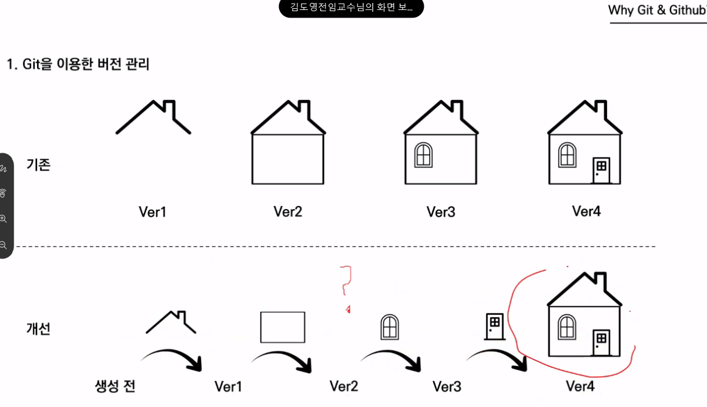

# Session 3.

## Git을 이용한 버전관리

git은 (분산)버전 관리 프로그램이다.

- 버전 : 컴퓨터 소프트웨어의 특정 상태

- 버전 관리 : 컴퓨터 소프트웨어의 특정 상태들을 관리하는 것

  

- 왜 수정했는지 이유를 적음으로써 소통할 수 있다.
- 분산 
  - 중앙 집중식 버전 관리
    - 버전관리 내용을 한 서버에서 다루는 것이다. 
    - A라는 사람과 B라는 사람이 있을 때 하나의 서버에서 가져와서 확인할 수 있다.
    - 서버가 터지면 모든 정보가 날아간다는 단점이 있다.
  - 분산 버전관리
    - 하나의 내용을 서버와 A와 B 모두가 가지고 있는 것이다. 
    - 모두가 관리하는 것이다.
    - 서버가 터져도 A 혹은 B가 가진 것으로 다시 되살릴 수 있다

## Github를 이용한 포트폴리오

- 깃허브를 통해서 업계에 대한 관심과 활동도를 확인할 수 있다.
- 깃허브 서비스에 버전관리 내용을 업로드하여 분산관리시스템을 완성하는 것이다.
- Github 외에도 Gitlab, Bitbucket을 사용한다.

- **.git 폴더를 통해 해당폴더부터 하위폴더까지 git으로 관리됨을 의미한다**.

- git은 세 가지 공간을 가지고 있다.

  - 예시
    - 패션잡지 촬영을 하는 곳에 탈의실, Studio, 사진 저장소가 있다.
    - 탈의실에서 모자를 쓴 모델이
    - 스튜디오에서 사진을 촬영한다.
    - 촬영된 사진은 사진 저장소에 저장된다.

  - 작업공간을 Working Directory, 사진을 찍는 공간을 Staging Area, 사진 저장소를 local Repository라고 볼 수 있다.
  - 깃은 **Working Directory, Staging Area, local Repository(Commits)**라는 세 가지 공간을 가지고 있다. 
    - Staging Area 는 확인, 검수, check 하는 공간이다.

  ### 명령어

  - Working Directory > Staging Area 에서 사용하는 명령어가 **git add**
  - Staging Area > Working Directory에서 사용하는 명령어가 **git commit**
  - Working Directory는 차이점을 구분해내서 이를 체크한다. 
  - **git은 가장 최신의 버전을 반영**한다. 

  

### git의 상태

- untracked

  - **처음으로 관리되는 대상** (핵심)
  - **빨간색**으로 표시된다.
  - **처음으로 관리되는 대상**이 **Working directory에 있는 상태(Staging Area에 올라가기 전)**

- tracked

  - Staging Area에 올리면 tracked로 변경된다.

  - 관리되고 있는 대상

  - Working directory에 있다하더라도 처음 관리대상이 아니면 tracked 상태이다.

  - tracked에도 modified와 unmodified 두 가지로 나뉜다.

    - modified : 주로 **녹색**으로 표시된다.
    - unmodified : 아무런 표시가 나지  않는다. 

    

### git 사용자 설정하기

$ git config --global user.email beeee2@naver.com

$ git config --global user.name beeee2

## git commit

**$ git commit -m 'first commit'**
[master (root-commit) 1fc14b9] first commit
 5 files changed, 355 insertions(+)
 create mode 100644 readme.md
 create mode 100644 startcamp/CLI (Command Line Interface).md
 create mode 100644 startcamp/git.assets/image-20220113134113263.png
 create mode 100644 startcamp/git.md
 create mode 100644 "startcamp/\353\247\210\355\201\254\353\213\244\354\232\264(Markdown).md"

hyunbee@LAPTOP-VQFRJFAR MINGW64 ~/ssafy7/TIL (master)
**$ git status**
On branch master
nothing to commit, working tree clean

hyunbee@LAPTOP-VQFRJFAR MINGW64 ~/ssafy7/TIL (master)

### git log

커밋 내용 확인하기

**$ git log**
commit 1fc14b9eca8f0f6d558d8a6ce8b4a34ac3f9511d (HEAD -> master)
Author: beeee2 <beeee2@naver.com>
Date:   Thu Jan 13 15:26:24 2022 +0900

    first commit

### 요약

### git add

- git add . 
  - 현재 폴더에 있는 전부 staging area로 올린다는 의미
  - .은 all을 의미한다. 
