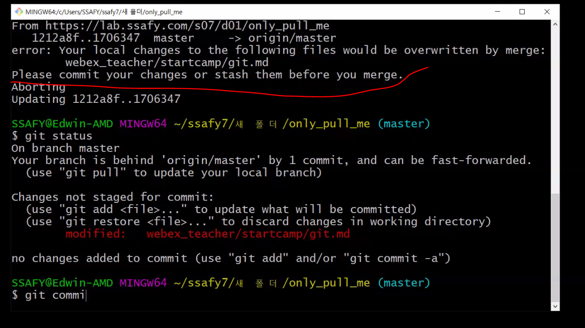

# Session 3.

## Git을 이용한 버전관리

git은 (분산)버전 관리 프로그램이다.

- 버전 : 컴퓨터 소프트웨어의 특정 상태

- 버전 관리 : 컴퓨터 소프트웨어의 특정 상태들을 관리하는 것

  

- 왜 수정했는지 이유를 적음으로써 소통할 수 있다.
- 분산 
  - 중앙 집중식 버전 관리
    - 버전관리 내용을 한 서버에서 다루는 것이다. 
    - A라는 사람과 B라는 사람이 있을 때 하나의 서버에서 가져와서 확인할 수 있다.
    - 서버가 터지면 모든 정보가 날아간다는 단점이 있다.
  - 분산 버전관리
    - 하나의 내용을 서버와 A와 B 모두가 가지고 있는 것이다. 
    - 모두가 관리하는 것이다.
    - 서버가 터져도 A 혹은 B가 가진 것으로 다시 되살릴 수 있다


## Github를 이용한 포트폴리오

- 깃허브를 통해서 업계에 대한 관심과 활동도를 확인할 수 있다.
- 깃허브 서비스에 버전관리 내용을 업로드하여 분산관리시스템을 완성하는 것이다.
- Github 외에도 Gitlab, Bitbucket을 사용한다.


- **.git 폴더를 통해 해당폴더부터 하위폴더까지 git으로 관리됨을 의미한다**.

- git은 세 가지 공간을 가지고 있다.

  - 예시
    - 패션잡지 촬영을 하는 곳에 탈의실, Studio, 사진 저장소가 있다.
    - 탈의실에서 모자를 쓴 모델이
    - 스튜디오에서 사진을 촬영한다.
    - 촬영된 사진은 사진 저장소에 저장된다.

  - 작업공간을 Working Directory, 사진을 찍는 공간을 Staging Area, 사진 저장소를 local Repository라고 볼 수 있다.
  - 깃은 **Working Directory, Staging Area, local Repository(Commits)**라는 세 가지 공간을 가지고 있다. 
    - Staging Area 는 확인, 검수, check 하는 공간이다.

  ### 명령어

  - Working Directory > Staging Area 에서 사용하는 명령어가 **git add**
  - Staging Area > Working Directory에서 사용하는 명령어가 **git commit**
  - Working Directory는 차이점을 구분해내서 이를 체크한다. 
  - **git은 가장 최신의 버전을 반영**한다. 

  

### git의 상태

- untracked

  - **처음으로 관리되는 대상** (핵심)
  - **빨간색**으로 표시된다.
  - **처음으로 관리되는 대상**이 **Working directory에 있는 상태(Staging Area에 올라가기 전)**

- tracked

  - Staging Area에 올리면 tracked로 변경된다.

  - 관리되고 있는 대상

  - Working directory에 있다하더라도 처음 관리대상이 아니면 tracked 상태이다.

  - tracked에도 modified와 unmodified 두 가지로 나뉜다.

    - modified : 주로 **녹색**으로 표시된다.
    - unmodified : 아무런 표시가 나지  않는다. 

    

### git 사용자 설정하기

$ git config --global user.email beeee2@naver.com

$ git config --global user.name beeee2


## git commit

**$ git commit -m 'first commit'**
[master (root-commit) 1fc14b9] first commit
 5 files changed, 355 insertions(+)
 create mode 100644 readme.md
 create mode 100644 startcamp/CLI (Command Line Interface).md
 create mode 100644 startcamp/git.assets/image-20220113134113263.png
 create mode 100644 startcamp/git.md
 create mode 100644 "startcamp/\353\247\210\355\201\254\353\213\244\354\232\264(Markdown).md"

hyunbee@LAPTOP-VQFRJFAR MINGW64 ~/ssafy7/TIL (master)
**$ git status**
On branch master
nothing to commit, working tree clean

hyunbee@LAPTOP-VQFRJFAR MINGW64 ~/ssafy7/TIL (master)


### git log

커밋 내용 확인하기

**$ git log**
commit 1fc14b9eca8f0f6d558d8a6ce8b4a34ac3f9511d (HEAD -> master)
Author: beeee2 <beeee2@naver.com>
Date:   Thu Jan 13 15:26:24 2022 +0900

    first commit


### 요약


### git add

- git add . 
  - 현재 폴더에 있는 전부 staging area로 올린다는 의미
  - .은 현재 위치를 의미한다.

### git commit

- git commit -m 'add readme.md'


** 주의사항

타이포라를 만들 때는 저장 위치를 먼저 지정해둔다. 나중에 스크린샷을 불러올 때 

엑박이 뜨는 것을 방지하기 위함이다.(저장이 안된 상태에서는 이미지가 홈드라이브를 기준으로 경로가 설정된다.)


---


## github에 저장하기

지금까지 로컬저장소에서 작업하였다. 만약 로컬에 있는 .git 폴더를 삭제하면 작업했던 모든 내용이 삭제된다. 우리는 원격 저장소(github, remote repository)를 연결하여 내용들을 관리하도록 한다. 

### 로컬저장소에 있는 파일들 원격저장소에 업로드하기

1. 원격저장소 정보등록 (url 정보)

   ```
   git remote add origin https://github.com/beeee2/TIL.git
   ```

   원격저장소를 추가한다. 마지막에 .git은 생략가능하다.

   - git remote add [remote별명] [remote 주소]
     - 해당 별명으로 해당 주소가 저장된다.
   - origin은 컨벤션이다. 

2. 로컬 내용을 원격 저장소로 push 한다. 
   - `git push -u origin master`


### 원격저장소에 있는 파일 다운로드하기

- B컴퓨터에서는 git init > git remote > git pull 의 과정을 거쳐 파일을 다운로드 할 수 있다.
- 혹은 git clone [리모트주소] 를 통해 바로  복제할 수 있다. 
  - 이미 git이 있고 다른 버전이 업로드 된 거라면 git pull만 해주면된다.
  - git cllone은 git init과 git remote이 포함되어 있기 때문이다.
- git clone의 시점은 아무것도 없는 상태에서 파일을 가져오려고 할 때 사용한다.


- 만약 GIT 안에 GIT이 존재할 수 있다. (서브모듈이 존재하는 경우)
  - 우리는 하지 않을 예정이다.
  - 만약 있다면 하위 폴더의 GIT 날리기





---

아래는 교수님께서 정리해주신 내용입니다.

# Git

> git은 분산버전관리 시스템(DVCS, Distributed Version Control System)
>
> 소스 코드의 버전을 관리하고 이력도 관리할 수 있다.


### 준비하기

1. 윈도우에 git을 설치한다. (git bash 설치)
2. 초기 설치 완료 후 로컬 컴퓨터에 ```Author``` 정보를 설정해야 한다.

``` bash
$ git config --global user.email 유저이메일
$ git config --global user.name 유저네임

$ git config --global -l // 설정 값을 확인하는 명령어
```


### 로컬 저장소

#### 1. 저장소 초기화

``` bash
$ git init

~/ssafy (master) // master 명 확인으로 git 관리여부 확인
```

| Working directory                                            | Straging Area                                                | local Repository (commit)                      |
| ------------------------------------------------------------ | ------------------------------------------------------------ | ---------------------------------------------- |
| 실제 작업되는 공간<br /> 변경점이 나타나면 이곳에 파일이 등록된다. | commit 되기 전 임시로 파일들이 보여지는 곳이다. <br /> 이곳에서 commit 되어도 되는지 파일을 확인한다. | git으로 관리되는 파일들의 버전들이 저장되는 곳 |

- git commit -a  

​		: staging area 단계를 생략한다.

- git commit --amend

​		: commit 메세지를 변경한다 


#### 2.  상태를 확인

``` bash
$ git status // WD, SA의 상태를 확인하기 위한 명령어
```

- Untracked
  - git으로 관리되지 않았던 파일이 등록된 경우
  - 빨간색으로 표시
  - 주로 WD에서 해당 단어를 확인할 수 있다.
- Tracked
  - Untracked에서 git add를 통해 SA로 올라오면 New file이 된다.
  - New file : git으로 관리되지 않았던 파일이 Straging Area에 등록되었을 때 확인할 수 있다.
  - 초록색으로 표시된다
  - modified : igt으로 관리되는데 수정된 파일이 Straging Area에 등록되었을 때 

#### 3. git ignore

> 주의 : gitignore에 먼저 등록하고 add를 보자
>
> 미리 add 되어 있으면 gitignore에 등록되어 있어도 계속 관리된다.

- 깃에 올리지 않을 것을 선택할 수 있다.(필터링의 기능)
- 관리하기 싫은 파일도 add . 을 하면 같이 Staging Area 등록된다. 만약 특정 파일을 올리고 싶지 않다면 rm을 통해 지워야 하는 번거로움이 있다.
- 관리하기 싫은 file의 데스노트(관리하기 싫은 파일의 목록)를 작성해서 **SA로의 접근을 막는다.**(WD로 가는 것은 반영한다.)
- 프로젝트에 관련 없는 파일
  - 민감한 개인파일
  - 개인 컴퓨터 설정 파일 (OS에서 활용되는 파일)
  - IDE 환경 설정 파일(.idea/)
  - 가상환경 폴더 및 파일(vnev/)
- ``` .gitignore``` 파일을 생성(확장자는 띠로 없음)
  - 제외하고 싶은 파일을 등록
  - 파일명을 적어주면 끝
- 한 번 관리되고 있으면gitignore 에 기재해도 gitinore를 무시한다.

- .gitignore내에 파일명을 등록해도 돈다.
- 특정 확장자만 무시하는 방법도 있다.
  - ``` *.png``` png 확장자를 가진 파일들은 전부 무시가 된다.
  - ```!d.txt```  : 이 때 특정 파일 하나는 등록되어야 하는 경우
  - ```폴더경로/폴더명/슬러쉬``` : 폴더를 무시한다.
    - ```temp/```
- gitignore.io 를 이용하면 편하게 .gitignore 파일을 작성할 수 있음
  - 단, 우리가 생성한 파일은 우리가 직접 등록해야 함


#### 4. Commit을 위한 준비

``` bas
$ git add 파일명
$ git add . // .은 현재 폴더 내에 있는 변경/후가된 파일 모두를 등록
```

- Working Directory에서 Staging Area로 관리파일들을 이동시키는 명령어 
- Staging Area에서 관리 대상에 대한 판단을 하고 commit 여부를 결정한다.


#### 5. Commit 하기

``` bash
$ git commit -m "커밋 메세지 잘 남기자!"
```

- 커밋메세지로 다른 작업자분들이 어떤 부분이 수정되었는지 확인할 수 있다. (**커밋메세지는 유의미한 내용**으로 작성할 것)
- 버전 이력을 확정짓는 명령어
- 해당 시점의 파일의 변경된 내용을 스냅샷으로 기록해 남긴다


#### 6. Commit 이력 확인하기

``` bash
$ git log
$ git log --oneline // 여러 줄로 나오는 commit 메세지를 한 줄로 축약해서 보여준다
$ git log -p // 파일의 변경 내용도 같이 보여준다. 
$ git log -숫자 // 숫자만큼만 보여준다.(원하는 갯수만큼 보여준다.)
```


### 원격 저장소 (Remote Repository)

- github / gitlab

#### 1. 원격 저장소 등록

- 사용을 하기 위해서는 로컬에 원격 저장소의 url 주소를 등록해야 한다.

``` bash
$ git remote add 저장소별명(origin) 저장소주소
```

- 메인 Repository라면 저장소 별명은 origin을 쓰는 것을 권유한다. 
- 등록된 원격저장소의 주소를 확인하는 방법

``` bash
$ git remote -v
```

- 저장소 삭제하는 방법

``` bash
$ git remote rm 저장소별명
```


#### 2. 원격 저장소에 commit 내용 보내기

- 로컬에 저장된 commit을 원격 저장소로 전달하여 분산 버전 관리를 완성하는 부분

``` bash
$ git push 저장소별명 브랜치명
$ git push -u origin master
```

- ```-u``` : --set-upstream의 shortcut 형태이고 저장소 별명과 브랜치 명을 설정하는 것이다.


---

## 원격 저장소에서 내려받기

### 1. git clone

- git init, git remote add 동작이 포함된 내려받기 명령어
- 아무것도 없는 상태일 때 사용한다.


### 2. git pull

- remote 서버의 정보를 내려받는 명령어
- git이 적용되어 있어야 한다.(.git 폴더가 존재해야 함)

- remote 정보도 등록되어 있어야 한다.(원격저장소 위치가 있어야 받아올 수 있다.)
- `git pull [리모트 별명] [브랜치 명]`
  - 브랜치 명은 master라고 리모트 별명은 origin이라고 일단 기억해두도록 하자.


## 기타 ) 

#### submodule warning 메세지를 봤다!

1. 어떤 폴더가 submodule 인지 확인한다.
2. 해당 폴더로 찾아가서 .git 폴더를 제거한다.
3. 이미 Starging Area 올라간 상태라면

​	``` git rm -rf --cached ``` [폴더명] 으로 해당 폴더를 Staging Area에서 Working Driectory로 내린다.

4.  git status로 다시 상태체크
5. git add로 staging area에 다시올린다.
6. 그리고 다시 git status로 staging area올라온 상태파악
7. git commit을한다.

- 싸피 1학기 과정에서는 submodule 사용계획X
- CLI 환경에서(master)가 보이면 git init을 하지 않는게 좋다.
